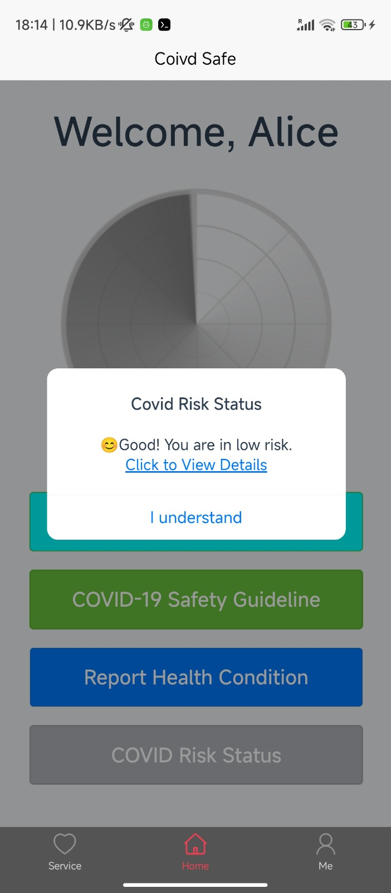

# Covid Safe App
### Group10
# Introduction
The COVID-19 pandemic, beginning in December 2019, led to unprecedented global disruptions,especially in public health, privacy, and the service industry. Public health responses worldwideemphasized digital solutions like contact tracing and remote service access to minimize physicalcontact, especially in home service sectors where direct interactions are typically unavoidable. Contacttracing apps were developed to address the rapid spread of COVID-19, but these apps raised significantconcerns about data privacy and information security due to their extensive data collection and trackingcapabilities. Consequently, it became imperative to adopt "privacy-by-design" approaches to balancehealth priorities with user privacy needs. These principles aim to ensure that personal information iscollected and used only when necessary, implementing safeguards that protect data throughout itslifecycle

## Features 
| Feature Category | Components |
|-----------------|------------|
| 🔐 User Registration and Login | • Secure sign-up process<br>• Strong password implementation<br>• Multi-factor authentication<br>• Credentials verification |
| 📅 Service Booking and Management | • General and specific service booking<br>• Interactive service showcase<br>• Search and filter functionality<br>• Scheduling tools |
| 💬 Secure Communication | • Messaging system between clients and providers |
| 💳 Payment Processing | • Multiple payment method support<br>• Recurring payment options |
| 🔒 Data Privacy and Compliance | • Data minimisation & anonymisation<br>• Privacy policy management<br>• User data controls<br>• Data retention policies<br>• Secure data backups & security logs |
| 🏥 COVID-19 Self-Reporting | • Status reporting system<br>• Exposure notifications |
| 🦠 COVID-19 Safety Features | • Health guidelines integration<br>• Vaccination status indicators<br>• Contactless interactions |
| 🎯 User Experience | • Intuitive interface<br>• Feedback system |
| 🛡️ Security Measures | • Access control<br>• Security assessments<br>• Secure app configuration<br>• Input/output validation |
| 📱 Contact Tracing | • Exposure/Risk Status<br>• Proximity tracking using Machine ID<br>• Temporary contact data storage<br>• Bluetooth-based methods |


## Project Directory Structure

## 📱 Frontend Application (fapp)
```plaintext
fapp/
├── 📄 Configuration Files
│   ├── .editorconfig
│   ├── .eslintignore
│   ├── .eslintrc.js
│   ├── .gitignore
│   ├── .prettierignore
│   ├── .prettierrc.js
│   ├── babel.config.js
│   ├── jsconfig.json
│   ├── postcss.config.js
│   └── vue.config.js
│
├── 📦 Package Files
│   ├── package.json
│   └── yarn.lock
│
├── 📂 Source
│   ├── src/
│   │   ├── App.vue
│   │   ├── main.js
│   │   ├── assets/
│   │   │   └── logo.png
│   │   └── components/
│   │       └── ExampleComponent.vue
│   │
│   └── public/
│       ├── favicon.ico
│       └── index.html
│
├── node_modules/
└── README.md
```
## 🖥️ Backend Server
```plaintext
backend/
├── 📄 Core Files
│   ├── app.js
│   ├── config.json
│   ├── package.json
│   ├── sqlfile.db
│   ├── run.bat
│   └── run.sh
│
├── 📸 Documentation Images
│   └── readmeimages/
│       ├── 1.jpeg, 1.txt
│       ├── 2.jpeg - 10.jpeg
│       ├── ccd.jpeg
│       ├── dfd.jpeg
│       └── scd.jpeg
│
├── node_modules/
└── README.md
```
**Key Features:**   
📱 Frontend: Vue.js based application with proper linting and formatting setup   
🖥️ Backend: Node.js server with SQLite database   
📄 Well-structured configuration files   
📸 Comprehensive documentation with visual aids   
🚀 Ready-to-run scripts for both Windows (.bat) and Unix-based (.sh) systems   

## Guide to Review the Server

### Quick Start

- **For Windows**: Run `run.bat` located in `./safehomeservice/backend`.
- **For Mac**: Run `run.sh` located in `./safehomeservice/backend`.

If these commands don't work, follow the detailed steps below:

---

### Detailed Steps to Run the Server

1. **Install Prerequisites**  
   Ensure the following are installed on your system:  
   - **Node.js**: Version 14.x or later  
   - **NPM**: Version 6.x or later (comes with Node.js)

2. **Navigate to the Backend Directory**  
   ```bash
   cd ./safehomeservice/backend
Install Dependencies
Run the following command to install the required npm packages:
   ```bash
      npm install
   ```
Optional: Configure Port

The default server port is 3000.
If you need to change it, update the port in the config file.
Start the Server
Start the server by running:
   ```bash
   node index.js
   ```

Tip: Ensure you are in the correct directory before running the command.

Additional Notes
If you encounter any issues, check the Node.js and NPM versions using the following commands:
   ```bash
   node -v
   npm -v
   ```

The default configuration is designed to work out-of-the-box. Port changes are typically unnecessary.


## 🛠️ Technical Stack

- **📱 Android App**:  
  Built using `uni-app`, `Vue.js`, `JavaScript`, and `Node.js`.

- **🔗 Backend**:  
  Powered by `Node.js` and the `Koa` framework.


## 📦 Package.json Overview

- **📂 `sqlfile`**: Database management (`sqlfile 5.1.7`).  
- **🌐 `https`**: Protocol for secure communication.  
- **🖥️ `koa.js`**: Lightweight server framework for `Node.js`.  
- **🔐 `sqlcipher`**: Database encryption tool for enhanced security.  
- **⬆️ Node**: Ensure the latest version of `Node.js` is installed.


## Build

- Install [Hbuilder](https://www.dcloud.io/hbuilderx.html) (Test and Build apk file according to your network)
- Run Hbuilder    
- import project from local directory     

- select " app" folder     

- open request/index.js
- change ip from "const base" to your ip     

- right click at any place to open the terminal    
      
- run command "npm install"           
     

- Enable develop modein your Android phone      
  - please refer to following guide    
- allow USB debugging on your Android phone
[how to allow usb debug](https://www.thecustomdroid.com/how-to-enable-usb-debugging-on-android-devices/)
- allow install via USB on your Android phone
- allow usb security debugging on your Android phone
- allow verify apps over USB on your Android phone
- Connect your Android phone to laptop using USB cable
- Open "run" tab on Hbuilder then Click "Mobile App Playground", then "Android Run"

     

- If you want to build to apk file, Click " Build" , then "App-Android/iOSp Cloud Package"      
  
- Select all the options shown in the picture below in red and green bases
- Install Hbuilder app


## App Architecture
### Application Data Flow Diagram (Level 1)  

### Client Class Diagram

### Server Class Diagram

## Watch the Video Presentation and Demo

[Click here to watch the video](https://youtu.be/rGcazToU5_4?si=Ygz9fpzrBrYrd6Ex)

## Introduction of the app
### Reister and Login Page
- Register as a user    
 
- Enter the user name and password, OTP will send to your google authenticator app  
  
- Password is hidden by default     


### Main Page
- You will see Four button in the Main Page  


#### Contact Tracing
- System will require you to enable bluetooth before using this function   


#### Covid 19 Safety Guideline   
- When you press this button, we will redirect you to the Government website about the Covid 19       


### Report Health Condition   
- You can report your health status here  


### Covid Risk Status
- You can check your Covid Risk Status here  
   
- For detailed information click on the link in the prompt  


## Service Page   
- When you click the bottom left corner, you will reach the Service Page   
 
- In Service Page, you will see "Service Request", "Service Package", "Nearby Service" and "My Order" 
  
### Service Request  
- You can make different requests here    
  
- You can notes while placeing the order for vendor   

- After you make the request, you are able to chat with the service provider  
   
- Once you agree on the terms and Price, you can click "Pay" (if you mentioned "order" in the chatroom, the "Pay" button pops up)   
   
- When you click "Pay", our app will redirect you to the third-Party Payment Page   

- Successful Payment    

- After you pay, you can see a finish button on the chatroom corresponding to the order   


### Service Package
- If you are a service provider, you can make your own service package here   


### NearBy Service
- You can check any nearby Service here   


### My Order      
- You can see your order here, if the project is not yet finished, it shows "on-going"    
      
- If you click "Finish" in the corresponding chatroom of the order, it will show "Finish"    


  


